.. vim: syntax=rst

报销流程
----

-  **发起报销**

页面路径：“采购报销”-“发起报销”

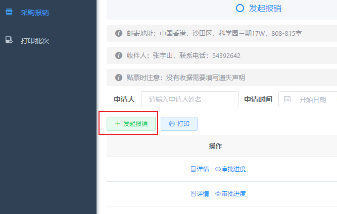

提示：一份表单对应一张收据，同一张收据里的物品报在一份表单即可，不需要分开填写。
表单中列出采购报销需要填写的字段，其中“采购项目”填写一张收据（若无收据则是订单）中包含的物品，列举几件即可；“兑港币汇率”是由系统从指定网站\ https://tw.exchange-rates.org/history/HKD/CNY/T 爬取的数据。

有收据：

无收据：

-  **上级审批**

提交表单后，部门（或团队）负责人会收到邮件，提醒有待审批的报销流程，点击邮件链接即可进入审批页面。

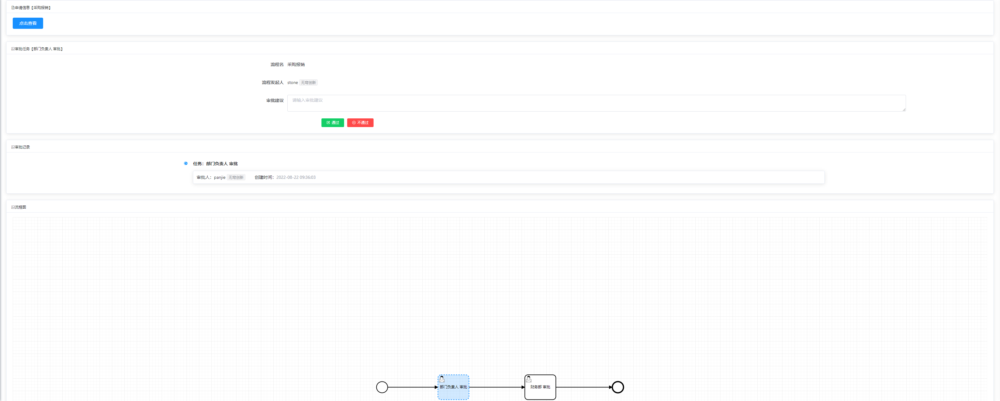

另外，还有两个方式可以进入审批页面：

1. “待审批报销”—“审批”

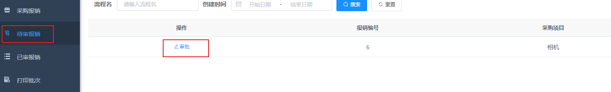

2. “采购报销”—“详情”

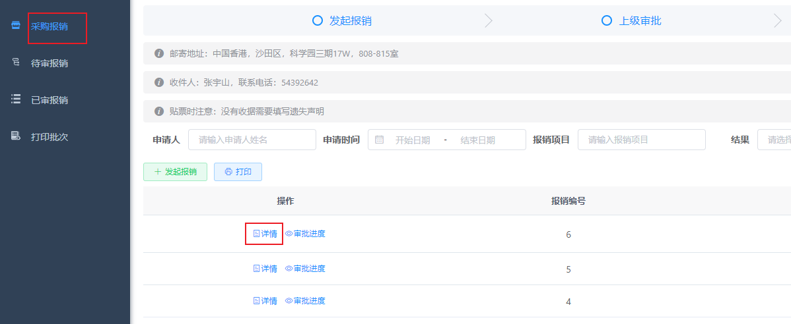

-  **财务部审批**

部门负责人审批通过后，财务部同事会收到邮件提醒，点击邮件链接即可打开审批页面。

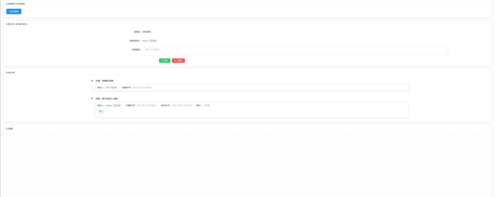

另外，还有两个方式可以进入审批页面：

1. “待审批报销”—“审批”

2. “采购报销”—“详情”

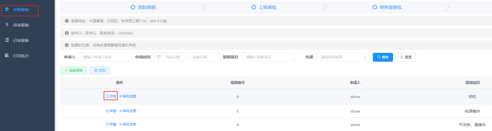

-  **审批通过或退回**

报销申请被审批通过或退回，提交表单的同事都收到邮件提醒，点击链接可以查看详情。

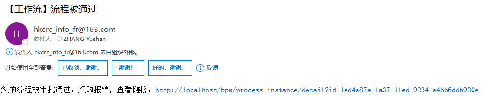

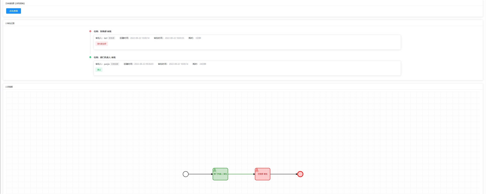

如果是被退回，可以在“采购报销”页面对这条记录进行修改，然后提交，重新发起审批流程。

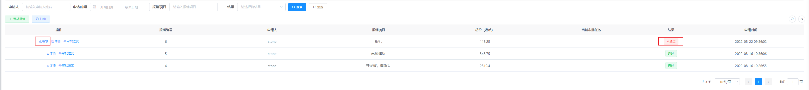

-  **打印**

审批通过的申请可以进行批量打印，系统会生成一份PDF报销单文件，下载下来后即可打印。

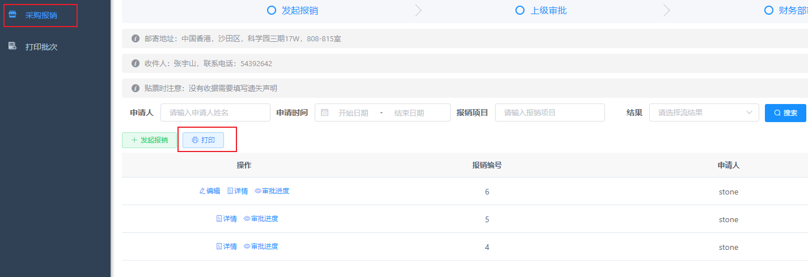

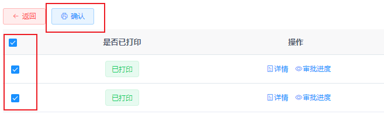

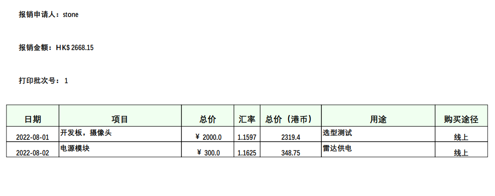

*没有收据的报销申请需要在收据遗失声明上签字，这份声明上的金额是系统在这一批次报销单中计算出没有收据的报销金额总和。*

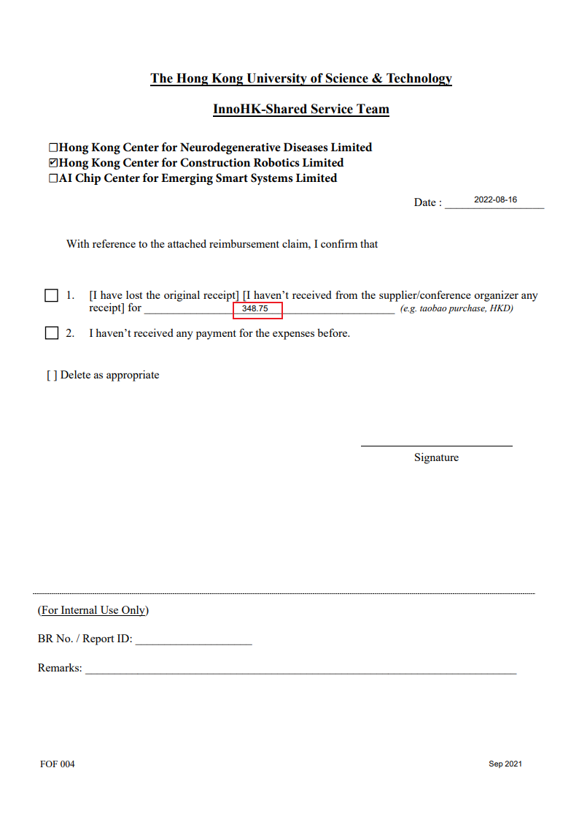

-  **贴票**

将收据粘贴在报销单指定位置

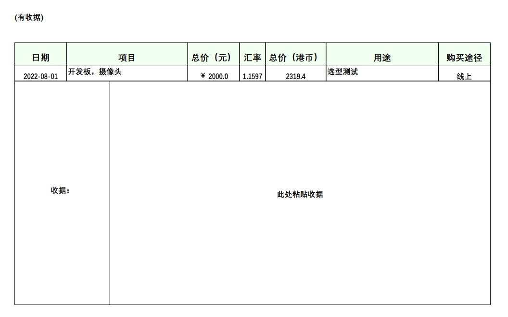

-  **邮寄**

贴票后，如果在香港，可以直接交给财务同事，如果在内地，就邮寄到CRC。

假如，财务同事收到文件后发现一些错误，比如金额填错了，我们可以打开菜单“打印批次”，通过文件上的批次号，找到对应记录进行编辑，编辑完成后可以打印这一批次的报销记录。

页面路径：“打印批次”—“详情”—“修改”

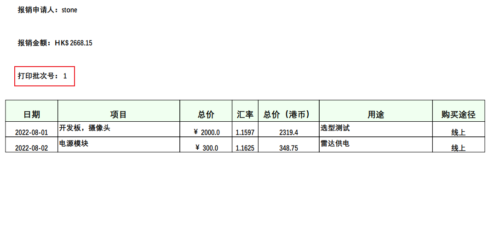

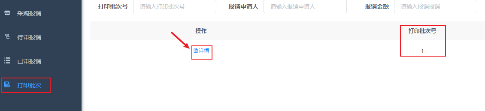

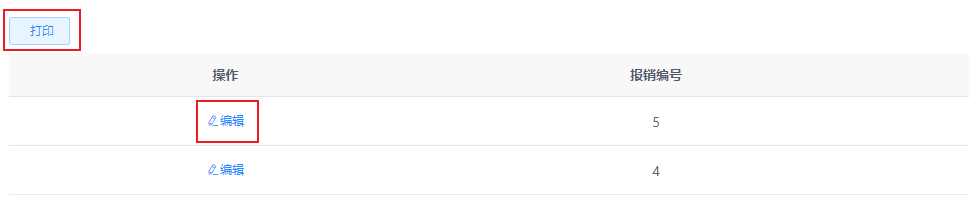
