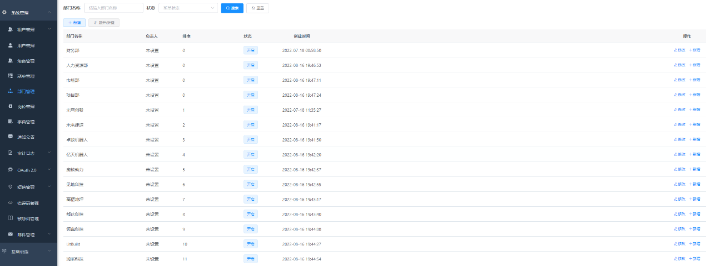
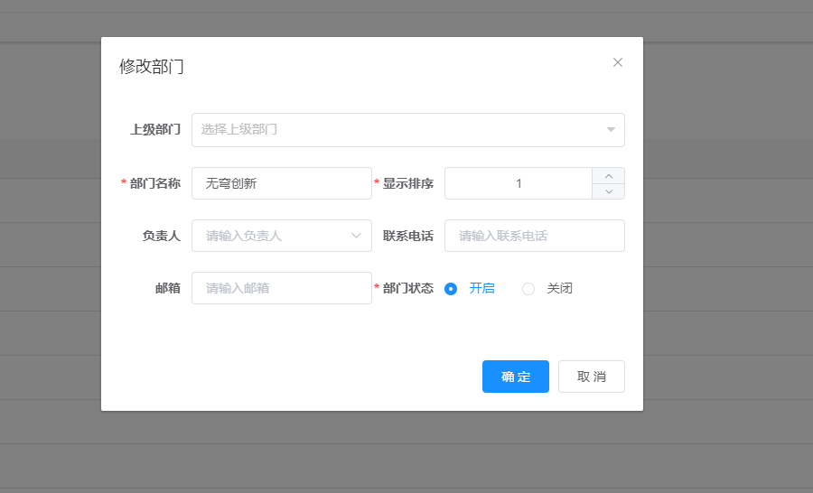
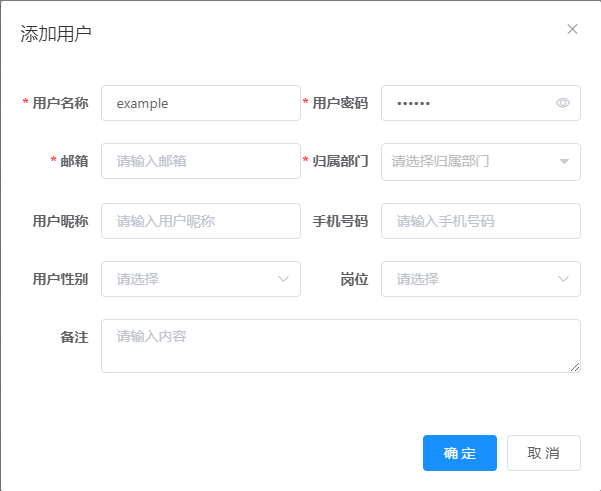
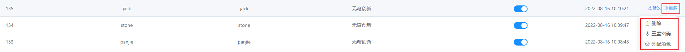

.. vim: syntax=rst

**管理功能**
--------

-  **部门管理**

包含添加部门、添加子部门、禁用部门、指定部门负责人等功能；

-  **用户管理**

包含添加用户、Excel批量导入用户、分配角色、重置密码、修改用户信息等功能；

-  **角色管理**

包含新增、禁用、删除角色，修改角色的菜单权限、数据权限等功能；

-  **审计日志**

包含查看操作日志、登录日志等功能；
